---

# Linked In Purry

## Deskripsi Aplikasi

Aplikasi **Linked In Purry** adalah sebuah aplikasi yang memudahkan jobseeker untuk mencari pekerjaan yang sesuai dengan keahlian mereka dan juga memudahkan company untuk mencari pekerja untuk perusahaan mereka
---

## Daftar Requirement

### Requirement
- **docker desktop**

---

## Cara Instalasi

### Langkah-langkah Instalasi

1. **Clone repositori ini ke dalam direktori lokal**:
   ```bash
   git clone https://github.com/Labpro-21/if3110-tubes-2024-k03-13.git
   cd if3110-tubes-2024-k03-13
   ```

2. **jalankan docker desktop**:

3. **lakukan docker build**:
   ```bash
   docker compose up --build
   ```

4. **buka localhost pada port 8080**:
   ```bash
   http://localhost:8080/
   ```
---

## Cara Menjalankan Server
  Pastikan direktori sudah berada pada ``if3110-tubes-2024-k03-13``
  kemudian jalankan docker desktop
   ```bash
   docker compose up
   ```
   Server akan berjalan di `http://localhost:8080`.

---

## Tangkapan Layar Aplikasi

### Halaman Register
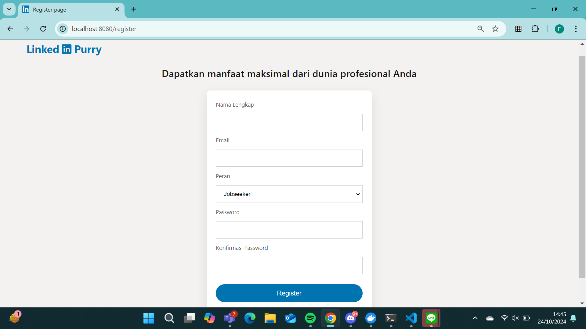

### Halaman Login
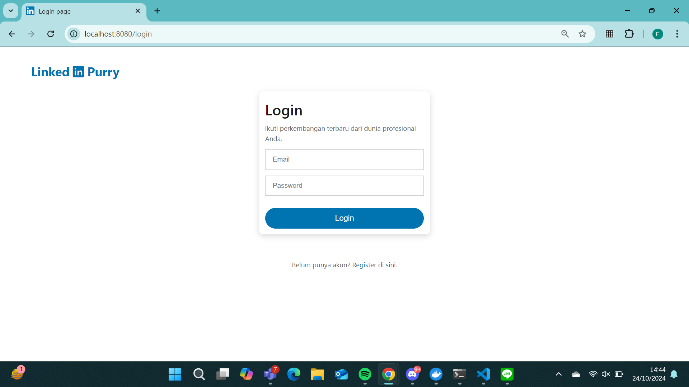

### Halaman Home (Jobseeker)
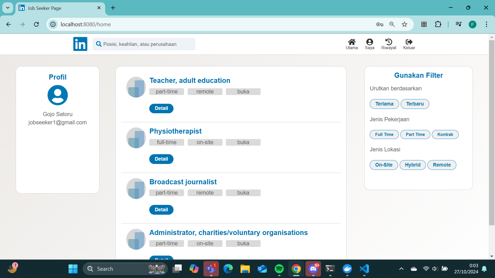

### Halaman Home (Company)
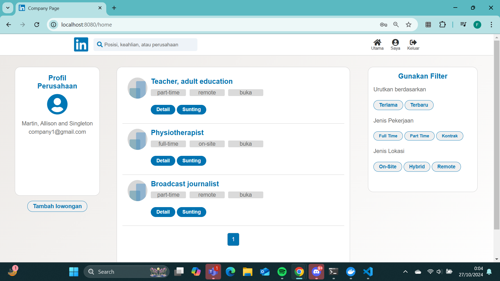

### Halaman Profil (Jobseeker)
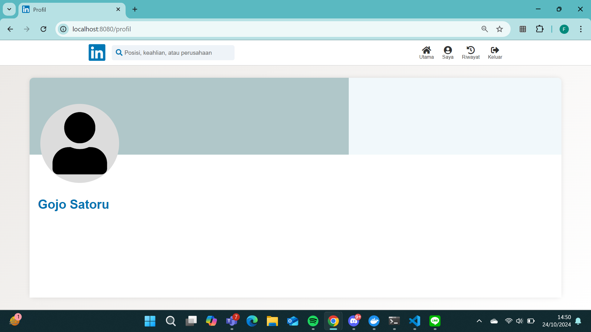

### Halaman Profil (Company)
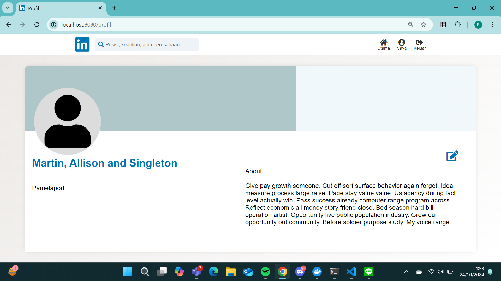

### Halaman Tambah Lowongan (Company)
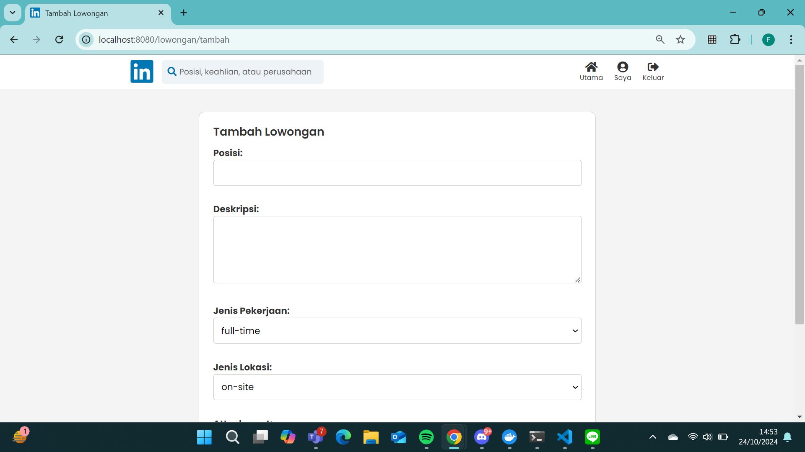

### Halaman Detail Lowongan (Company)
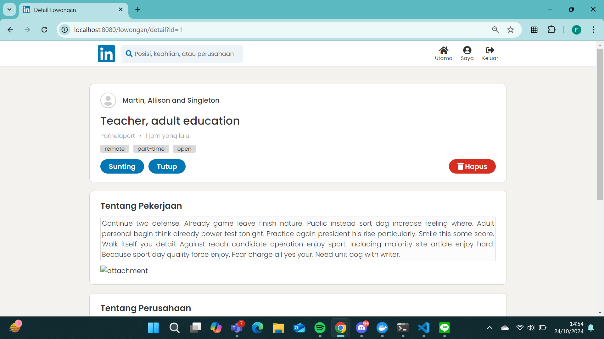

### Halaman Detail Lamaran (Company)
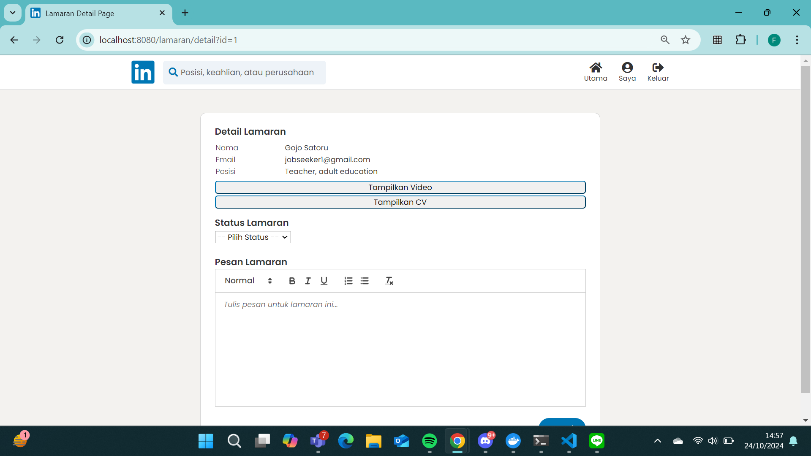

### Halaman Edit Lowongan (Company)
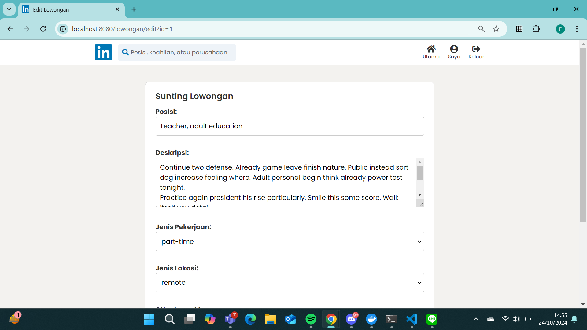

### Halaman Detail Lowongan (Jobseeker)
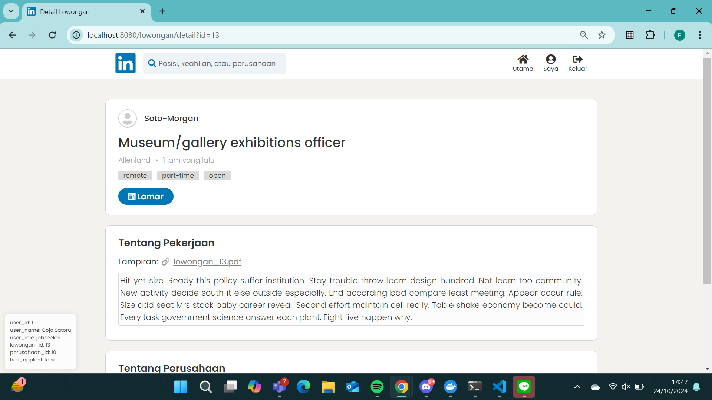

### Halaman Lamaran (Jobseeker)
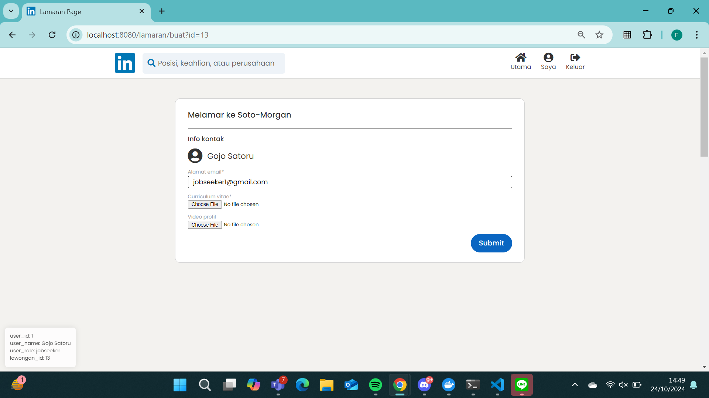

### Halaman Riwayat (Jobseeker)
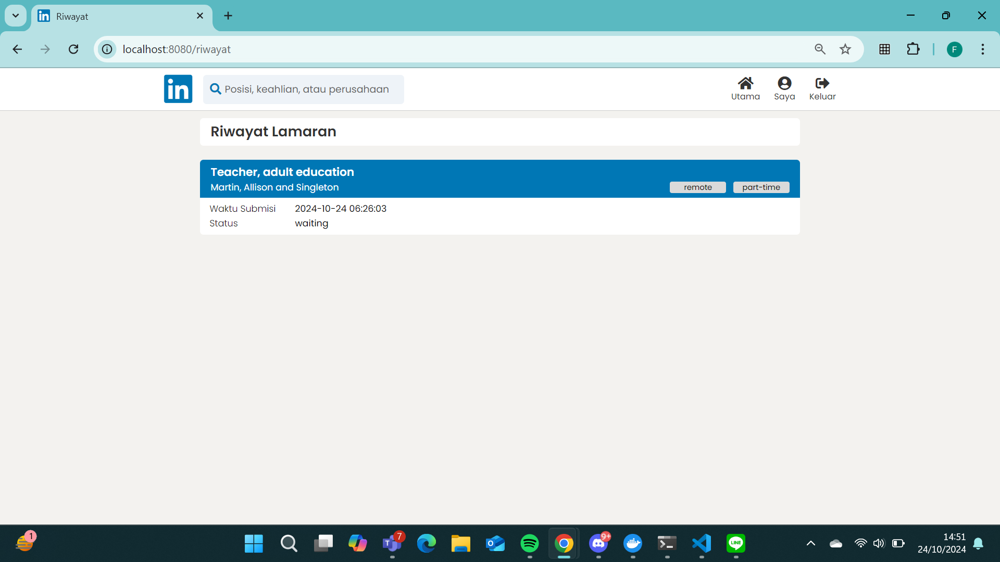

---

## Pembagian Tugas Anggota Tim


| Fitur/Halaman                         | Server Side      | Client Side    |
|-------------------------------|----------------------|----------------------|
| **Login**                      | 13522149             | 13522149             |
| **Register**                   | 13522149             | 13522149             |
| **Home (Job seeker)**          | 13522145             | 13522145             |
| **Home (Company)**             | 13522145             | 13522145             |
| **Tambah Lowongan (Company)**  | 13522137             | 13522137             |
| **Detail Lowongan (Company)**  | 13522137, 13522149   | 13522137, 13522149   |
| **Detail Lamaran (Company)**   | 13522137, 13522154   | 13522137, 13522154   |
| **Edit Lowongan (Company)**    | 13522137             | 13522137             |
| **Lamaran (Job seeker)**       | 13522137             | 13522137             |
| **Riwayat (Job seeker)**       | 13522137             | 13522137             |
| **Profil (Company)**           | 13522145, 13522137, 13522149   | 13522145             |
| **Profil (Job seeker)**        | 13522145, 13522137   | 13522145             |
| **Bonus Export**               | 13522149             | -                    |
| **Navigation Bar**             | -                    | 13522145             |
